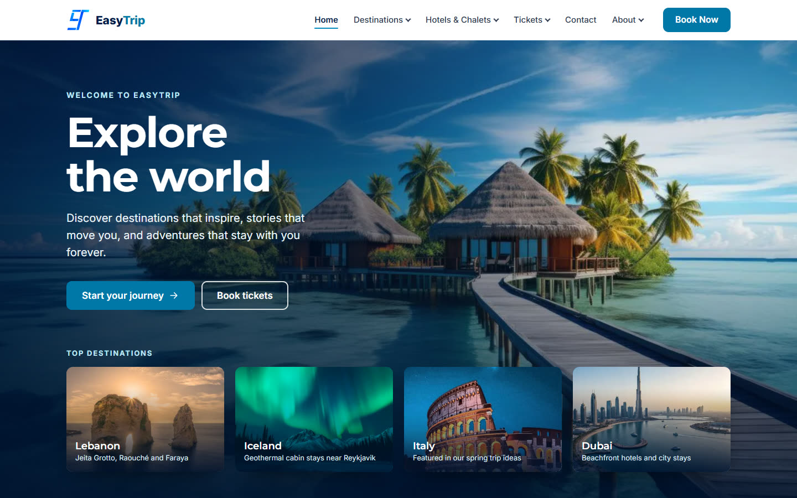

# EasyTrip — Travel Made Simple

EasyTrip is a travel website built with **PHP, HTML, CSS and vanilla JavaScript**.
Visitors can explore destinations by season, browse hotels and chalets, look at flight,
bus and train tickets, and send the team a message through the contact form.

> **University project.** EasyTrip demonstrates frontend and database-backed web development.
> Hotels, chalets, prices and ticket planners are sample content: nothing can be booked or paid for.

**Tech stack:** PHP 8 (server-side includes and the contact-form handler), MySQL/MariaDB
(contact messages only), HTML, CSS and vanilla JavaScript. No frameworks, build step or
package manager.




---

## Contents

- [Pages](#pages)
- [Running the project](#running-the-project)
- [Database setup (contact form)](#database-setup-contact-form)
- [Project structure](#project-structure)
- [How the shared header and footer work](#how-the-shared-header-and-footer-work)
- [Common changes](#common-changes)
- [Accessibility and performance](#accessibility-and-performance)
- [Known limitations](#known-limitations)
- [Credits](#credits)

---

## Pages

| Page | File | What it shows |
| --- | --- | --- |
| Home | `index.php` | Hero, top destinations, about, seasonal trip ideas, services, explore band |
| Destinations | `destinations.php` | Seasonal travel guide: compare winter, spring, summer and autumn, choose by experience |
| Winter / Spring / Summer / Autumn | `winter.php`, `spring.php`, `summer.php`, `autumn.php` | Trip ideas and featured countries for each season |
| Hotels & chalets | `hotels-chalets.php` | Accommodation guide: hotels vs chalets, quick comparison, what to consider |
| Hotels | `hotels.php` | Sample hotel collection: search, max sample price, sorting, "Show more", details dialog |
| Chalets | `chalets.php` | Sample chalets & private retreats: search, setting, max sample price, sorting, "Stays in Lebanon" shortcut, details dialog |
| All tickets | `tickets.php` | Transport choice: flights or bus & train, a quick comparison, a note that booking isn't connected yet |
| Flights | `flight.php` | Flight-planning prototype: round trip / one way, validated form, search summary (no live results) |
| Bus & train | `bus-train.php` | Ground-travel planning prototype: one form for bus or train, validation, route summary (no live results) |
| Who we are | `about.php` | About the EasyTrip team |
| Why choose EasyTrip | `why-easytrip.php` | Reasons to book with EasyTrip, video |
| Contact | `contact.php` | Contact form with guidance, field-level validation and success/error messages (saves messages to MySQL) |

---

## Running the project

### Requirements

- **PHP 8.1 or newer** with the `mysqli` extension (tested with PHP 8.3)
- **MySQL or MariaDB**, only needed for the contact form
- A modern browser

### Option A — PHP's built-in server (quickest)

From the project folder:

```bash
php -S localhost:8000
```

Open <http://localhost:8000>.

If the contact form says *"The message could not be sent right now"* and the server log says
`the PHP mysqli extension is not enabled`, enable it in your `php.ini` (`extension=mysqli`), or
start the server with it switched on:

```bash
php -d extension=mysqli -S localhost:8000
```

> The site must be opened through a server (`http://localhost/...`), not by double-clicking
> the files. Pages are `.php`, and the header and footer are loaded from `partials/`.

### Option B — XAMPP / WAMP / MAMP

1. Copy the `Easy_Trip` folder into the server's web root (for XAMPP: `C:\xampp\htdocs\`).
2. Start **Apache** and **MySQL** from the control panel.
3. Open <http://localhost/Easy_Trip/>.

---

## Database setup (contact form)

The contact page (`contact.php`) saves messages into MySQL. Everything else on the site works
without a database.

1. Start MySQL.
2. Import `database/easytrip_db.sql`:
   - **phpMyAdmin:** *Import* → choose `database/easytrip_db.sql` → *Go*, or
   - **Command line:** `mysql -u root < database/easytrip_db.sql`
3. This creates the `easytrip_db` database and its `contact_messages` table.

By default the handler (`includes/contact-handler.php`) connects with the usual local XAMPP/WAMP
settings: host `localhost`, user `root`, **no password**, database `easytrip_db`.

If your MySQL user needs other values, **don't write a real password into the code** (this
repository is public). Set environment variables instead; any you leave out keep the default:

| Variable | Default |
| --- | --- |
| `EASYTRIP_DB_HOST` | `localhost` |
| `EASYTRIP_DB_USER` | `root` |
| `EASYTRIP_DB_PASS` | *(empty)* |
| `EASYTRIP_DB_NAME` | `easytrip_db` |

For example, with PHP's built-in server in PowerShell:

```powershell
$env:EASYTRIP_DB_USER = "easytrip"; $env:EASYTRIP_DB_PASS = "your-local-password"
php -d extension=mysqli -S localhost:8000
```

With Apache (XAMPP), use `SetEnv EASYTRIP_DB_PASS ...` in a local, uncommitted config file.
`.env` files and `*.local.php` files are already excluded by `.gitignore`.

If the database isn't running, the form shows *"The message could not be sent right now. Please try
again later."*, keeps what the visitor typed, and writes the technical reason to the PHP error log
(never to the page).

The form fields (`name`, `email`, `phone`, `topic`, `message`) and the table are unchanged. The
handler checks each field (required fields, email format, phone characters, lengths that fit the
table) and only accepts these topics, saving the label: General question, Destinations,
Hotels & chalets, Flight planning, Bus & train planning, Website issue, Other. A link such as
`contact.php?topic=flights` opens the form with that topic chosen.

---

## Project structure

```text
Easy_Trip/
├── index.php                 Homepage
├── about.php                 Who we are
├── why-easytrip.php          Why choose EasyTrip
├── contact.php               Contact form (no Bootstrap; handler in includes/)
├── destinations.php          All destinations (by season)
├── winter.php  spring.php  summer.php  autumn.php
├── hotels-chalets.php        Hotels & chalets overview
├── hotels.php  chalets.php   Listings with filters
├── tickets.php               Tickets overview
├── flight.php  bus-train.php
│
├── partials/                 Shared page parts
│   ├── header.php            Logo, main navigation, Book Now button
│   └── footer.php            Footer links, social icons, copyright
│
├── includes/                 Server-side logic
│   └── contact-handler.php   Validates and saves contact form messages
│
├── database/
│   └── easytrip_db.sql       Database and table setup script
│
├── css/
│   ├── styles.css            Shared styles: header, footer, homepage, buttons
│   ├── reset.css             Older shared base styles (loaded by several pages)
│   ├── styles2.css           Older base styles (no longer loaded by any page)
│   ├── listings.css          Listing components (toolbar, cards, dialog) for hotels.php and chalets.php
│   └── <page>.css            One stylesheet per page (about, flight, winter, …)
│
├── js/
│   ├── includes.js           Loads header/footer and runs the navigation menu
│   ├── script.js             Scroll reveal (plus an old "stays" tab switcher no page uses any more)
│   ├── listings.js           Listing controller for hotels and chalets: filter, sort, show more, dialog
│   ├── flight.js             Flight planner: trip type, swap, date limits, validation, search summary
│   ├── bus-train.js          Route planner: bus/train mode, trip type, swap, validation, route summary
│   └── contact.js            Contact form extras: inline checks, error summary, focus, character count
│
├── assets/
│   ├── images/
│   │   ├── brand/            Logo (logo.svg is used on the site)
│   │   ├── home/             Homepage images (optimized .webp + fallbacks)
│   │   ├── destinations/     Destinations page images (optimized .webp + hero fallback)
│   │   ├── stays/            Hotels & chalets page images (optimized .webp)
│   │   ├── hotels/           Hotel card images (600×400 .webp crops)
│   │   ├── chalets/          Chalet card images (600×400 .webp crops)
│   │   ├── contact/          Contact page hero (.webp of support.png)
│   │   ├── tickets/          Tickets page images (optimized .webp)
│   │   ├── travel/           Transport images used by bus-train.php
│   │   └── *.png / *.jpg     Destination, hotel, chalet and page images
│   ├── models/travel-icons/  Low-poly 3D icons (plane, train, bus, chalet) as .glb, plus the script that makes them
│   └── videos/               About page video
│
└── docs/
    ├── screenshots/          Images used in this README
    └── template-reference/   Original design template (kept locally only; not in the Git repository)
```

### Naming rules

- File and folder names are **lowercase with hyphens**: no spaces, capitals or accents
  (for example `jeita-grotto.png`, not `Jeita Grotto.png`). Many web hosts run Linux,
  where `Lebanon.png` and `lebanon.png` are different files.
- Page names describe the page: `about.php`, `contact.php`, `why-easytrip.php`.

---

## How the shared header and footer work

The header and footer are written once, in `partials/header.php` and `partials/footer.php`.

- **Homepage, Destinations, Hotels & chalets, Hotels, Chalets, Tickets, Flights and Bus & train:**
  `index.php`, `destinations.php`, `hotels-chalets.php`, `hotels.php`, `chalets.php`, `tickets.php`,
  `flight.php` and `bus-train.php` include them with PHP, so they are in the page before any
  JavaScript runs. These pages still work with JavaScript turned off.
- **Other pages:** each page has two placeholders, which `js/includes.js` fills in:

  ```html
  <div id="include-header"></div>
  ...
  <div id="include-footer"></div>
  <script src="js/includes.js"></script>
  ```

`js/includes.js` also runs the **navigation menu** for every page:

- Desktop dropdowns open on hover, click or keyboard (Enter, Space, Arrow keys) and close with
  Escape, a click outside, or moving focus away.
- Below 1080px the menu collapses behind a menu button. Submenus expand in place, and
  **Book Now** stays visible.
- The current page is highlighted in the menu automatically.

---

## Common changes

### Add or change a menu link

Edit the `$et_nav` list at the top of `partials/header.php`:

```php
['label' => 'Tickets', 'id' => 'et-menu-tickets', 'items' => [
  ['label' => 'All tickets', 'href' => 'tickets.php'],
  ['label' => 'Flight tickets', 'href' => 'flight.php'],
]],
```

### Add or edit a hotel

Hotels are listed in the `$hotels` array at the top of `hotels.php`. Each entry is the name, location,
sample price per night, a one-sentence description, the image number and the image's alt text:

```php
['Berlin Art Hotel', 'Berlin, Germany', 180, 'A modern, art-focused hotel…', 11, 'Historic palace above terraced gardens'],
```

The page builds each card from this list and adds `data-name`, `data-location`, `data-price` and
`data-order` attributes, which `js/listings.js` uses for searching, the price filter and sorting.
Card images live in `assets/images/hotels/` as 600×400 WebP files named `hotel-<number>.webp`.

### Add or edit a chalet

Chalets work the same way, from the `$chalets` array at the top of `chalets.php`. Each entry also has
a **type** (Cabin, Villa, Lodge, …) and a **setting**, which must be one of the keys in `$settings`
just above it (`mountain`, `coastal`, `countryside`, `forest`, `desert`, `tropical`):

```php
['Lakeside Cabin', 'Bhamdoun, Lebanon', 160, 'Cabin', 'mountain', 'A rustic cabin with lake and forest views…', 10, 'Wooden cabin on stilts reflected in a still lake'],
```

The setting becomes the card's `data-setting` attribute, which the "Setting" filter uses, and appears
on the card as a label such as "Cabin · Mountain". The "Stays in Lebanon" button fills the search box
with "Lebanon", so it finds every chalet whose location contains that word.
Card images live in `assets/images/chalets/` as `chalet-<number>.webp`.

### Set the social media links

The footer shows Instagram, Facebook and TikTok. **Set these to EasyTrip's own profiles**
in the `$et_social` list at the top of `partials/footer.php`. They currently point to each
platform's home page:

```php
'Instagram' => [
  'url' => 'https://www.instagram.com/your_handle/',
  ...
],
```

### Change footer links

Edit `$et_footer_groups` in `partials/footer.php`. Each group is a heading plus its links.

### Brand colours

The main colours are CSS variables at the top of `css/styles.css`:

| Variable | Colour | Used for |
| --- | --- | --- |
| `--et-navy` | `#001B48` | Headings, footer, dark sections |
| `--et-royal` | `#02457A` | Button hover, gradients |
| `--et-primary` | `#0077A8` | Buttons and links (meets WCAG AA contrast with white) |
| `--et-sky` | `#018ABE` | Active-page underline, accents |

---

## Accessibility and performance

- A "Skip to main content" link, proper landmarks (`header`, `nav`, `main`, `footer`) and a
  logical heading order on the homepage.
- A visible focus outline on every link and button. Touch targets are about 44px.
- Colour contrast meets WCAG AA for text and buttons.
- Animations switch off for visitors who choose *reduce motion* in their system settings.
- Homepage images are resized WebP files (under 1 MB for the whole page), with sizes
  reserved to avoid layout jumps. The hero image loads first, and images further down load
  as you scroll.

---

## Known limitations

- **No accounts, booking or payment backend.** The flight and bus & train planners check what
  the visitor enters and show a summary, but there are no live routes, schedules or fares, and
  there is no login or registration.
- **Contact form** needs MySQL (see [Database setup](#database-setup-contact-form)). Messages are
  only stored: nothing emails them or replies, and there is no admin page to read them. Refreshing
  the page right after sending asks the browser to send the form again.
- **Social links** point to platform home pages until real profile URLs are added.
- Some pages still use older stylesheets (`reset.css`, `styles2.css`) that duplicate parts of
  `styles.css`. The shared header and footer use their own `et-` class names, so those files
  can't affect them.
- The destination photos from the old Flight page's "stays by destination" tabs are no longer used:
  `jeita-grotto.png`, `raouche-rock.png`, `jbayl.png`, `faraya.png`, `konyaalti-beach.png`,
  `kaleici-old-town.png`, `lara-beach.png`, `antalya-cirali.png`, `island-*.png`, `egypt-*.png` and
  `turkey-*.png` in `assets/images/`.
- These files are not used by any page yet: `css/styles2.css`, `assets/images/chalets-hero-detail.jpg`,
  `assets/images/brand/logo.png`, `assets/images/contact.png`, `assets/images/train.png`,
  `assets/images/tickets/busandtrain.jpg`, `assets/images/travel/cartravel.png` and
  `assets/videos/hotels-chalets-hero.mp4` (about 24 MB).

---

## Credits

- Homepage layout adapted from the *Responsive Travel Website* template by
  [Bedimcode](https://www.youtube.com/@Bedimcode) (the original template is kept locally in
  `docs/template-reference/` and is not published in this repository),
  including the about, explore and join photos.
- Social media icons from [Remix Icon](https://remixicon.com/) (Apache License 2.0).
- Fonts: [Inter](https://rsms.me/inter/) and [Montserrat](https://fonts.google.com/specimen/Montserrat),
  via Google Fonts.
